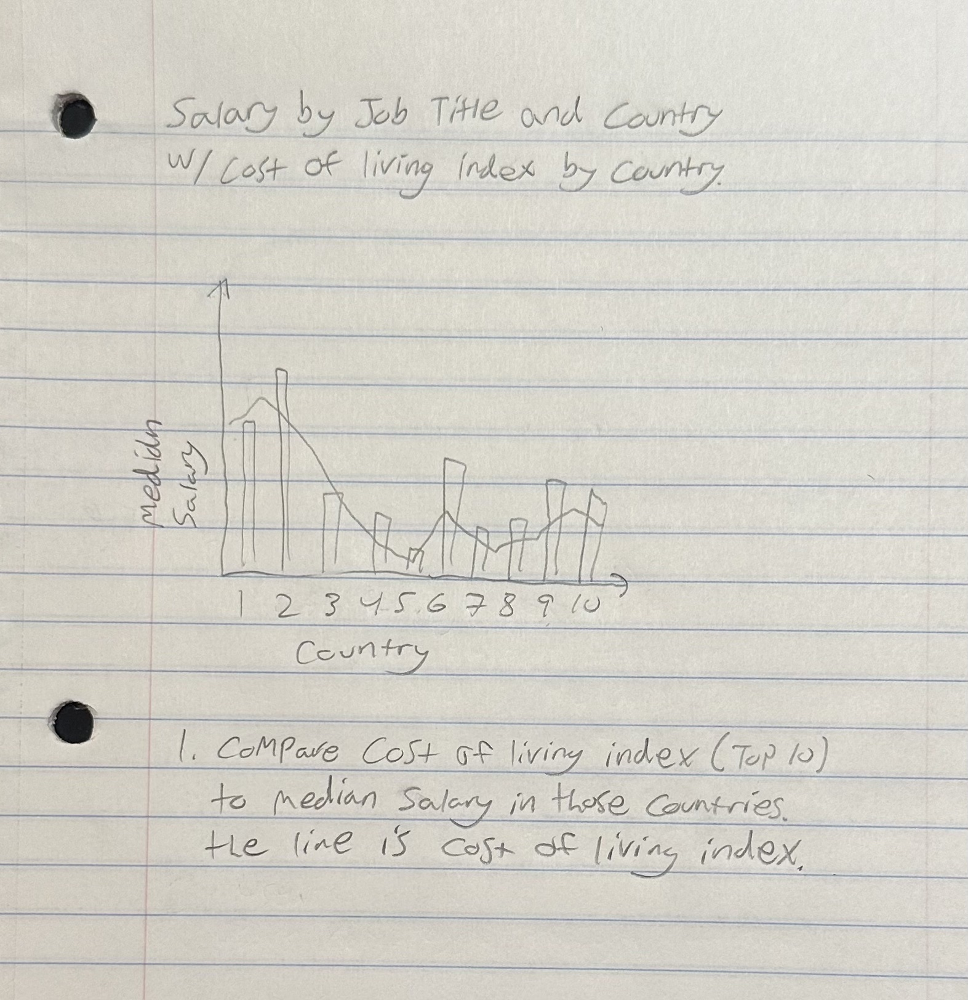
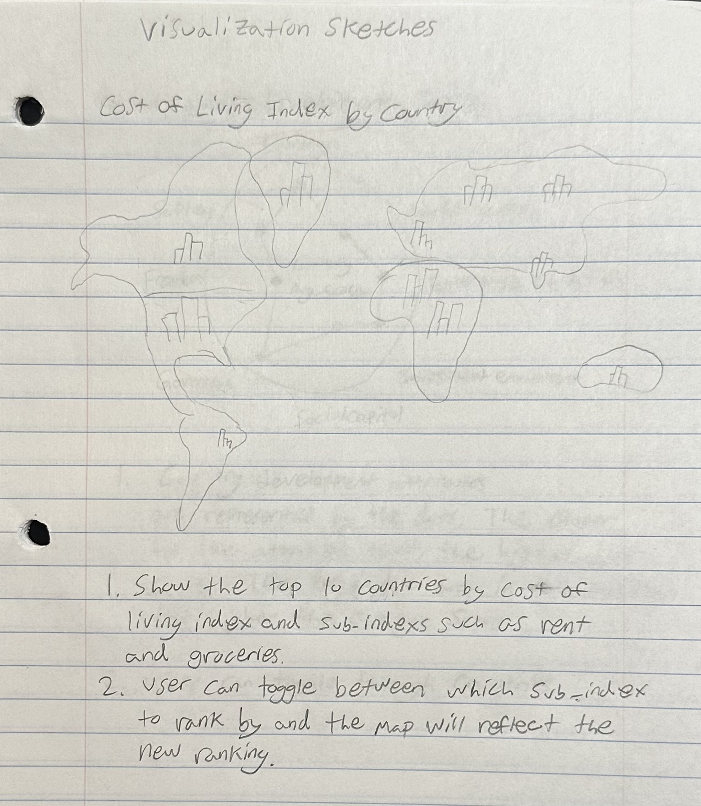
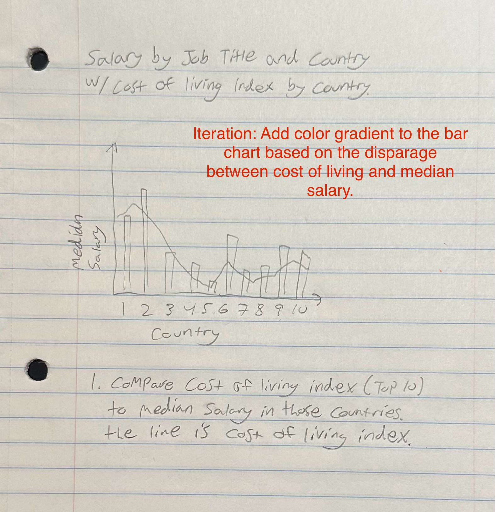
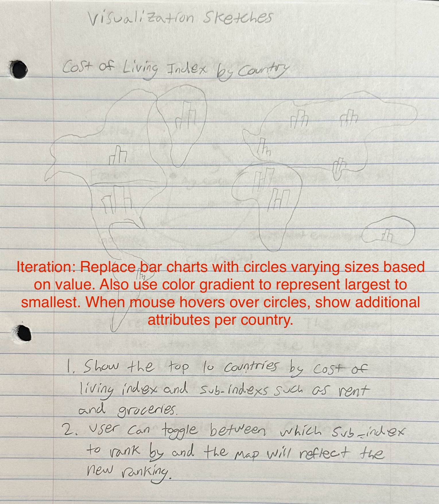
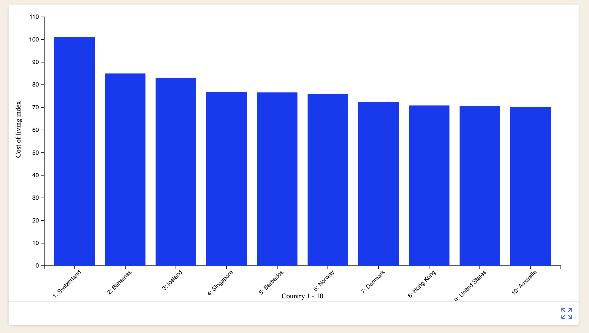
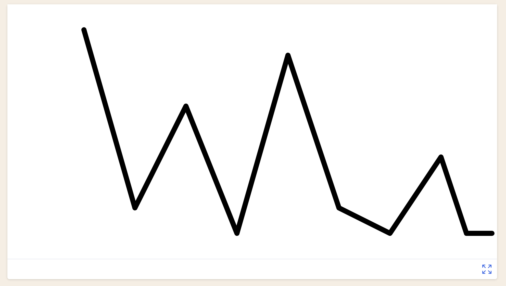
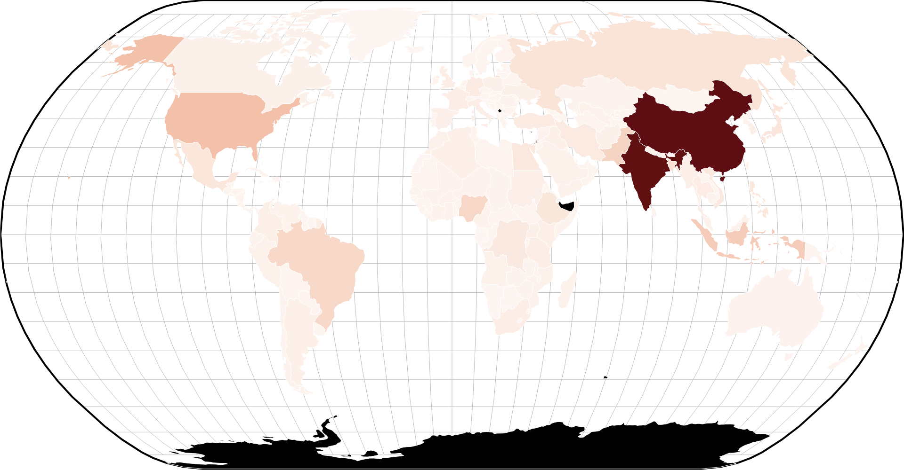
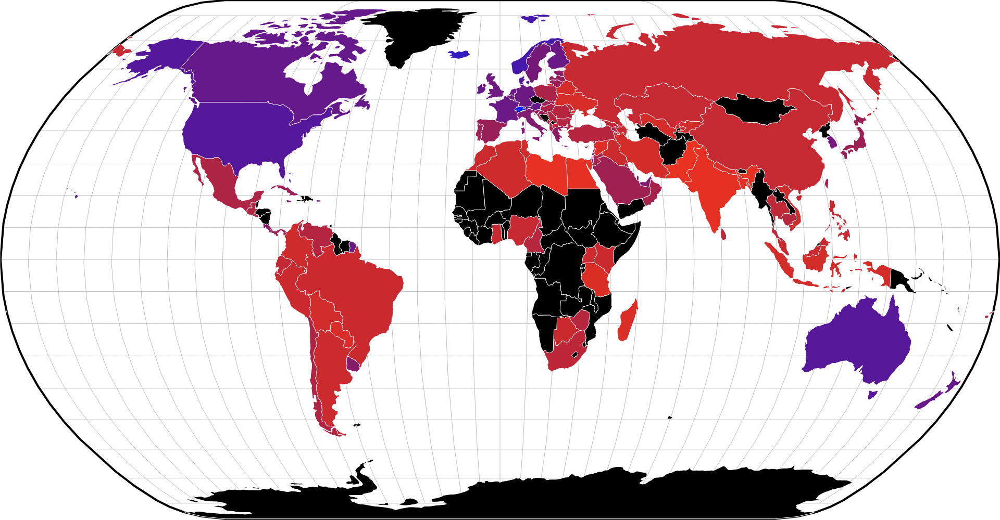
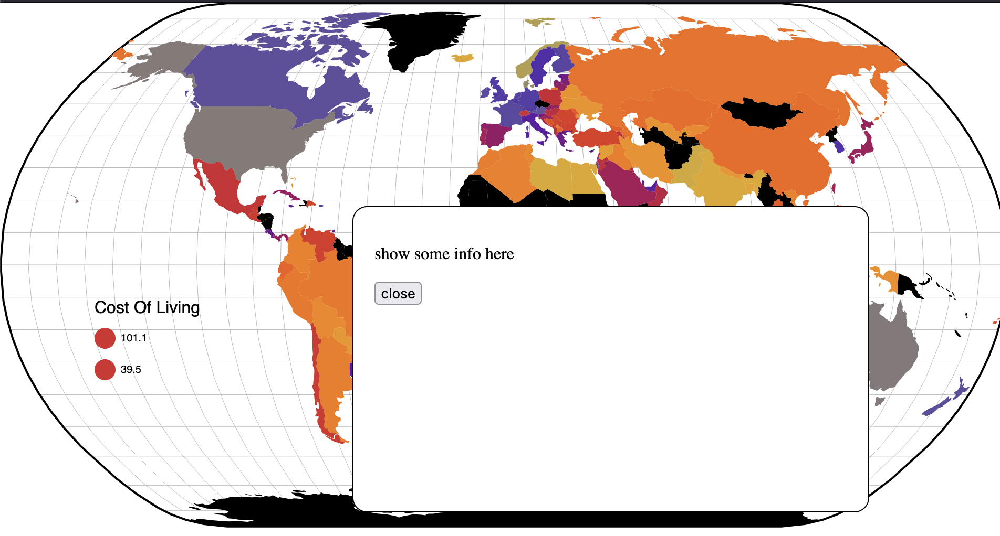

# Data Visualization Project

## Data

The data I propose to visualize for my project is [

A cost of living index of 100 is equivalent to New York City where monthly costs for a family without rent are $6,074.40 and individuals are $1,640.90.

* Cost of Living Index (Excl. Rent): This index indicates the relative prices of consumer goods like groceries, restaurants, transportation, and utilities. It excludes accommodation expenses such as rent or mortgage. For instance, a city with a Cost of Living Index of 120 is estimated to be 20% more expensive than New York City (excluding rent).
* Rent Index: This index estimates the prices of renting apartments in a city compared to New York City. If the Rent Index is 80, it suggests that the average rental prices in that city are approximately 20% lower than those in New York City.
* Cost of Living Plus Rent Index: This index estimates consumer goods prices, including rent, in comparison to New York City.
* Groceries Index: This index provides an estimation of grocery prices in a city relative to New York City. Numbeo uses item weights from the "Markets" section to calculate this index for each city.
* Restaurants Index: This index compares the prices of meals and drinks in restaurants and bars to those in NYC.
* Local Purchasing Power: This index indicates the relative purchasing power in a given city based on the average net salary. A domestic purchasing power of 40 means that residents with an average salary can afford, on average, 60% less goods and services compared to residents of New York City with an average salary.

## Questions & Tasks

The following tasks and questions will drive the visualization and interaction decisions for this project:

 * I want to understand the geographical distribution of the cost of living index.
 * I want to see correlation between rent index and groceries index.
 * I want to see correlation between local purchasing power index and the cost of living index.
 * I want to see correlation between the cost of living index dataset and the global country development and prosperity index dataset.
 * I want to understand the geographic distibution of rent index.

## Sketches

Below are some sketches of my proposed visualization.

[

[

Below are iteration comments for proposed visualization sketches.

[

[

## Prototypes

I have created 3 proof of concept visualizations for this dataset.

Below is a bar chart representing the top 10 countries by cost of living. 

The bar chart above is to be paired with a line graph that represents the median salary within those countries. (shown below) This data is from a sepatate dataset.

The wold map below represents the cost of living in each country where the more blue/purple a country is, the higher the cost of living.

## Milestones

* Week 1   - Implement full datasets
* Week 2   - Combine line and bar chart
* Week 3  - Explore additional ways to represent individual countries
* Week 4  - Implement individual country representation
* Week 5  - Add tooltips
* Week 6  - Finalize visualization
* Week 7  - Complete project

## Week 1

Full datasets have been implemented into previous data visualizations. At this point, I may be pivoting to add the ability to show additional data per country, one country at a time, instead of just the top ten cross examined with salary. Each country will be selectable.

## Week 2

Direction change for vizualization. Data set applied to world map that allows for country selection (currently mouseover only). Next steps are to include additional data per country selected. This information will appear in a popup when a country is clicked. Possible graphics include radar chart of index breakdown, country rankings and salary display. Any advice on additional information to include or methods to compare countries would be appreciated. Thank you!

## Week 3

Color key added (still working to make color gradient interpolation work with key). Added country selection fucntionality to represent additional country data. Next steps are to fix colors and create additional visualizations for additional country information.

## Week 4

Color was changed to use a color scale however country pop-up is functional and displays country and cost of living. Next steps are to add secondary vizualization to pop-up that breaks down the cost of living scoreds in each country and displays rank.

## Week 5

Radar Graph is added when country is selected. Next steps are to clean up presentation and add color gradient to circles in radar chart.

## Week 6

